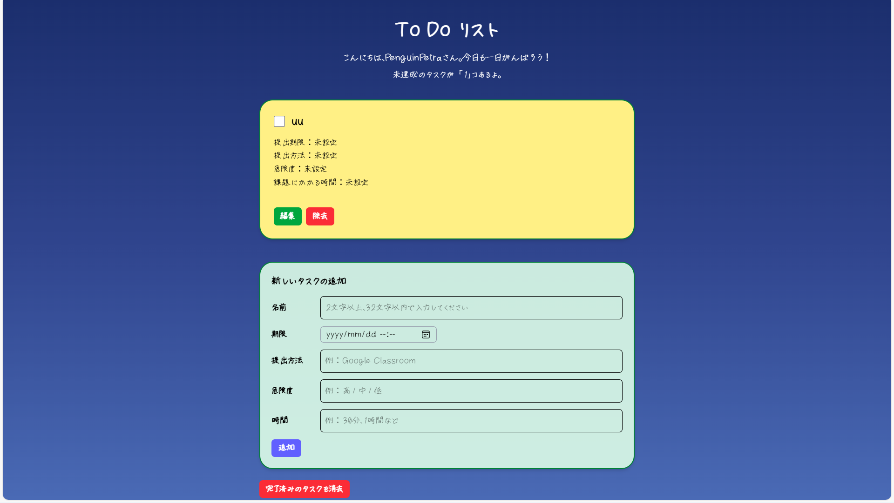
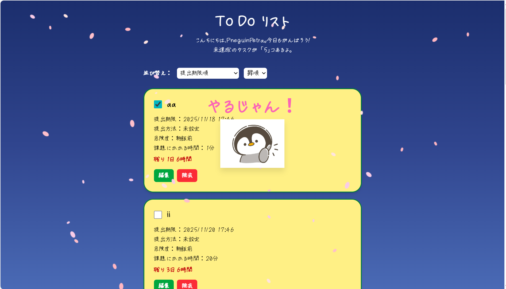
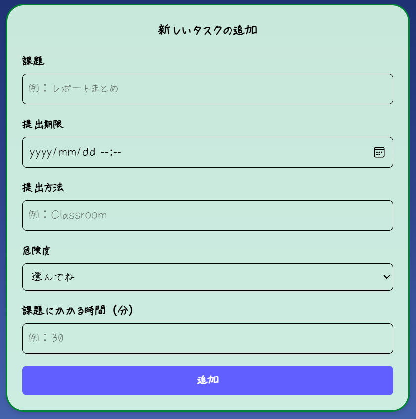

# モチベーションを生むToDoアプリ

## Todoアプリをホストしている GitHub Pages の URL
https://penguinpetra.github.io/react-todo-app/



---

## 目次
1. [コンセプト](#-コンセプト)
2. [アプリ概要](#-アプリ概要)
3. [主な機能](#-主な機能)
4. [一押しポイント](#-一押しポイント)
5. [使用技術](#-使用技術)
6. [セットアップ方法](#-セットアップ方法)
7. [技術的チャレンジ](#-技術的チャレンジ)
8. [今後の改善](#-今後の改善)
9. [ライセンス](#-ライセンス)

---

## コンセプト
このアプリは、単なるタスク管理ツールではありません。  
**「楽しみながら続けられる」** にこだわり、タスク達成時に花びらが舞ったり、効果音が鳴ったりすることで**達成感とやる気**を引き出す設計になっています。

---

## アプリ概要
React × TypeScript で作られたToDoアプリです。  
タスクの追加・編集・消去・保存に加え、以下のような便利な情報を付加できます：

- 締切日時（残り時間や経過時間を表示）
- 提出方法（Google Classroom、Teamsなど）
- 危険度（簡単～自分では解決できない）
- 課題にかかる時間（分単位、数値のみ入力）

タスクは `localStorage` に保存されるので、ブラウザを閉じてもデータが消えません。

---

## 主な機能

| 機能 | 内容 |
|------|------|
| タスク追加 / 編集 / 消去 | 入力制限あり、バリデーション付き |
| 残り時間/経過時間表示 | 締切まであと何日？何時間？を自動表示 |
| フィルタリング・並べ替え | 期限・危険度・作業見積時間で昇順/降順選択可 |
| 課題詳細入力 | 提出方法 / 危険度 / 課題にかかる時間（数値のみ）など |
| 達成時の演出 | 花びら（Confetti）＋「やるじゃん！」コメント＋効果音 |
| レスポンシブ対応 | スマートフォン、タブレット、PC可 |
| 永続化 | localStorage 保存でデータ保持 |

---

## 一押し・工夫ポイント

### 1. 達成感アップ！スタンプと花びらの演出
- タスク完了で花びらが舞い、スタンプ音が鳴る！
- 「やるじゃん！」というメッセージでモチベーションUP


### 2. 癒し効果のある夜空デザイン
- Tailwindで夜空グラデーション背景を実装
- 星や流れ星による癒しの視覚演出


### 3. 学生に最適化した入力設計
- 危険度や提出方法、課題にかかる時間などを細かく入力可能
- 見通しを立てやすいタスク管理を実現


### 4. yosugaraフォントで親しみやすさUP
- 手書き風フォントを採用し、硬さのない柔らかいUIを実現

### 5. スマホ対応！どこでも使えるタスク管理
- Tailwind CSSのブレークポイントを活用し、レスポンシブに対応。
- スマートフォンでもタスク入力や操作がしやすいUIを実現。
- 画面幅に応じて自動でレイアウトが変わり、常に見やすく操作しやすい設計です。

---

## 使用技術・ライブラリ

| 分類 | 使用技術 |
|------|----------|
| フロントエンド | React / TypeScript |
| UIスタイリング | Tailwind CSS（レスポンシブ対応）、yosugara手書き風フォント |
| アニメーション | Framer Motion、Canvas |
| 日時処理 | dayjs |
| ID生成 | uuid |
| 永続化 | localStorage |
| 効果音 | HTML Audio API |
| アイコン | Font Awesome |

---

## セットアップ方法

セットアップ方法

ローカル環境で動かしたい場合：

```bash
# クローン
git clone https://github.com/penguinpetra/react-todo-app.git
cd react-todo-app

# 依存関係インストール
npm install

# 開発サーバー起動
npm start
```


## 開発期間

**2025.10.23 ~ 2025.11.19（約30時間）**  

---

## ライセンス

MIT License

Copyright (c) 2025 Penguin Petra

Permission is hereby granted, free of charge, to any person obtaining a copy
of this software and associated documentation files (the "Software"), to deal
in the Software without restriction, including without limitation the rights
to use, copy, modify, merge, publish, distribute, sublicense, and/or sell
copies of the Software, and to permit persons to whom the Software is
furnished to do so, subject to the following conditions:

The above copyright notice and this permission notice shall be included in all
copies or substantial portions of the Software.

THE SOFTWARE IS PROVIDED "AS IS", WITHOUT WARRANTY OF ANY KIND, EXPRESS OR
IMPLIED, INCLUDING BUT NOT LIMITED TO THE WARRANTIES OF MERCHANTABILITY,
FITNESS FOR A PARTICULAR PURPOSE AND NONINFRINGEMENT. IN NO EVENT SHALL THE
AUTHORS OR COPYRIGHT HOLDERS BE LIABLE FOR ANY CLAIM, DAMAGES OR OTHER
LIABILITY, WHETHER IN AN ACTION OF CONTRACT, TORT OR OTHERWISE, ARISING FROM,
OUT OF OR IN CONNECTION WITH THE SOFTWARE OR THE USE OR OTHER DEALINGS IN THE
SOFTWARE.